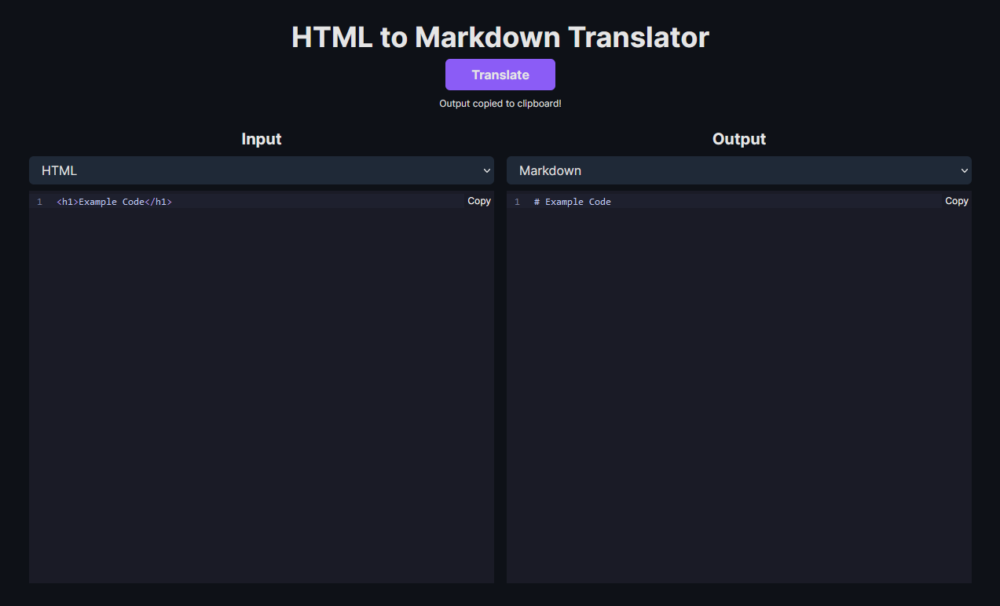

# HTML to Markdown Translator

Translate HTML to Markdown for any MD or MDX project you are creating.



## Running Locally

**1. Clone Repo**

```bash
git clone https://github.com/npasqualetti/html-to-markdown.git
```

**2. Install Dependencies**

```bash
npm i
```

**3. Run App**

```bash
npm run dev
```

## Contact

If you have any questions, feel free to reach out to me: [Email](mailto:nick@nickpasqualetti.dev).
